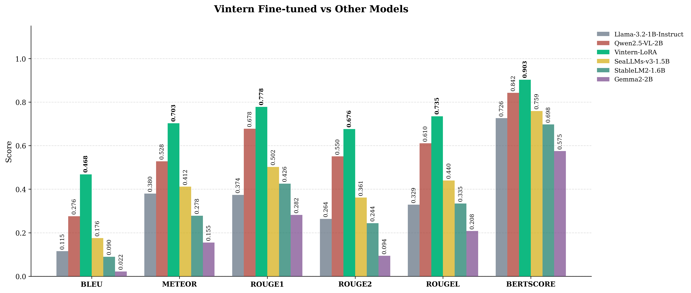
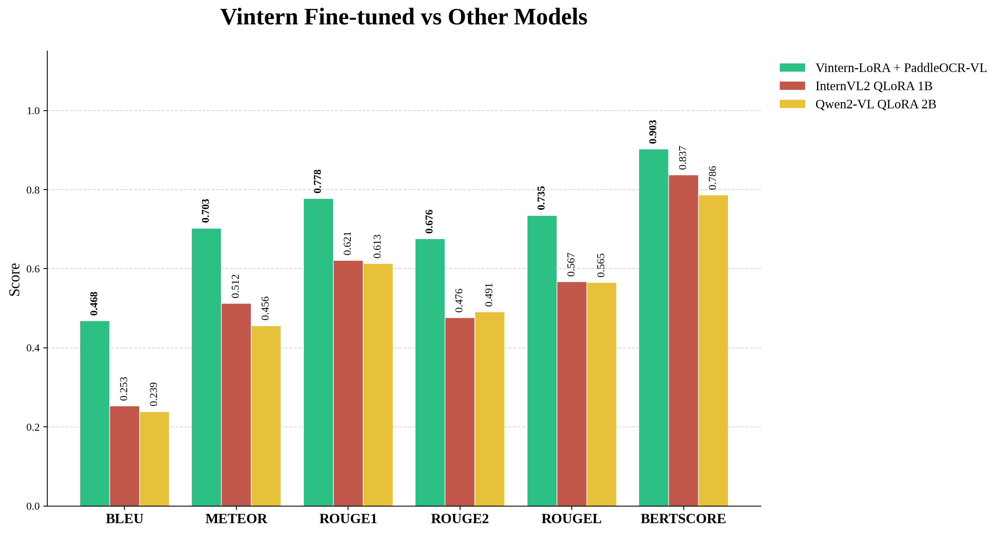

# ChartVQA Pipeline — Intelligent Chart Question Answering System

ChartVQA is an intelligent chart question-answering system designed to help users understand information presented in charts and graphs. The project combines computer vision, optical character recognition, and vision-language models to analyze an uploaded chart and answer questions about its content in Vietnamese or English.

The system processes each request through a three stage pipeline. First, a ResNet18-based classifier identifies the chart type, such as a bar chart, pie chart, or line chart. This classification helps determine whether the chart can be processed by the system. Next, PaddleOCR-VL extracts structured information from the chart, including labels, values, text, and relationships between visual elements. Finally, the Vintern vision-language model uses the original chart image, the detected chart type, and the extracted data to generate a natural-language answer to the user's question.

The application is implemented with FastAPI and provides both a web interface and REST API endpoints. Users can upload chart images in common formats such as PNG, JPG, JPEG, and WEBP, then submit questions, the system returns the chart type, extracted data, generated answer, support status, and processing latency. It also provides session-based functionality, allowing an uploaded chart to be analyzed once and queried through a dedicated session.

Because PaddleOCR-VL and Vintern require incompatible versions of the Transformers library, the project separates them into two virtual environments and two services. The main FastAPI application runs on port 8000, while the PaddleOCR-VL extraction server runs independently on port 8001. This architecture isolates dependencies while allowing the models to communicate through HTTP.

The project is optimized for local GPU inference using CUDA and supports locally stored model weights. It was developed and run on a machine with 4GB VRAM. It includes configuration management, upload validation, health monitoring, Swagger API documentation, latency measurement, and GPU memory cleanup. Overall, the project provides an end-to-end solution for converting visual chart data into accessible, conversational answers.

## Evaluation Results

The model was fine-tuned (LoRA) on a custom dataset and benchmarked using BLEU, METEOR, ROUGE-1/2/L, and BERTScore — outperforming baseline models (Qwen2.5-VL-2B, InternVL-FT, Llama-3.2-1B, SeaLLMs, StableLM2, Gemma2) as well as the original pretrained checkpoint.



All three models — **Vintern-LoRA + PaddleOCR-VL**, **InternVL2 QLoRA 1B**, and **Qwen2-VL QLoRA 2B** — were fine-tuned on the same training dataset, allowing for a fair, apples-to-apples comparison of architectures under identical training conditions.

The chart below compares their performance across BLEU, METEOR, ROUGE-1, ROUGE-2, ROUGE-L, and BERTScore.


Full details (charts, scores, merge/unmerge comparison, PaddleOCR-VL) are available in [`doc/evaluation`](doc/thesis.pdf).

## Architecture

```
Chart Image + Question
        ↓
   ResNet18 (Classify chart)
        ↓
   PaddleOCR-VL (extract data from chart)
        ↓
   Vintern fine-tunning (answer the question)
        ↓
      Result
```

---

## Project Structure

```
your/path/to/files
├── paddle_server.py          # Dedicated server for PaddleOCR-VL (port 8001)
├── venv_paddle\              # Dedicated virtual env for Paddle (transformers>=4.45)
│
└── files\
    ├── main.py               # Main FastAPI app (port 8000)
    ├── pipeline.py           # Orchestrator coordinating the 3 steps
    ├── config.py             # Path, device, and parameter configuration
    ├── chart_classifier.py   # Chart classifier
    ├── data_extractor.py     # HTTP client calling paddle_server:8001
    ├── chart_qa.py           # Vintern QA engine
    ├── index.html            # Web UI
    ├── requirements.txt
    ├── models_local\
    │   ├── vintern\          # Vintern-1B-v2 weights
    │   └── paddleocr_vl\     # PaddleOCR-VL weights
        └──resnet18
    └── venv\                 # Main virtual env (transformers==4.44.2)
```

---

## Why Two Virtual Environments

PaddleOCR-VL and Vintern require **two conflicting versions of transformers**:

| | venv (Main) | venv_paddle (Paddle) |
|---|---|---|
| transformers | `==4.44.2` | `>=4.45` |
| Contains | Vintern + Main FastAPI | PaddleOCR-VL + Mini FastAPI |
| Port | 8000 | 8001 |

---

## Initial Setup

### 1. Download the models locally

```powershell
cd your/path/to/files

# Vintern
python -c "from huggingface_hub import snapshot_download; snapshot_download('5CD-AI/Vintern-1B-v3_5', local_dir='./models_local/vintern')"

# PaddleOCR-VL
python -c "from huggingface_hub import snapshot_download; snapshot_download('PaddlePaddle/PaddleOCR-VL', local_dir='./models_local/paddleocr_vl')"
```

### 2. Create venv_paddle

```powershell
cd your/path/to/files

python -m venv venv_paddle
venv_paddle\Scripts\activate

python -m pip install torch torchvision --index-url https://download.pytorch.org/whl/cu121
python -m pip install "transformers>=4.45" accelerate pillow fastapi uvicorn python-multipart httpx
```

### 3. Install dependencies for the main venv

```powershell
cd your/path/to/files
venv\Scripts\activate

python -m pip install torch torchvision --index-url https://download.pytorch.org/whl/cu121
python -m pip install "transformers==4.44.2" accelerate pillow fastapi uvicorn python-multipart httpx ultralytics timm pydantic-settings
```

---

## Running the System

Each run requires **2 terminals**:

### Terminal 1 — Paddle Server

```powershell
cd your/path/to/files
venv_paddle\Scripts\activate
python -m uvicorn paddle_server:app --port 8001
```

Wait until you see:
```
PaddleOCR-VL ready on cuda
```

### Terminal 2 — Main App

```powershell
cd your/path/to/files
venv\Scripts\activate
python -m uvicorn main:app --host 0.0.0.0 --port 8000
```

Wait until you see:
```
Pipeline ready in ~39s
All models loaded. API ready.
```

### Open the Web UI

Go to: **http://localhost:8000**

---

## Usage

1. Open **http://localhost:8000**
2. Upload a chart image (PNG, JPG, WEBP — max 10MB)
3. Enter your question (Vietnamese or English)
4. Click **Analyze & Answer**
5. View the results: chart type, extracted data, answer, and latency

---

## API Endpoint

### `POST /api/ask`

```bash
curl -X POST http://localhost:8000/api/ask \
  -F "image=@chart.png" \
  -F "question=Which company has the highest revenue?"
```

Response:
```json
{
  "question": "Which company has the highest revenue?",
  "answer": "FPT has the highest revenue.",
  "chart_type": "h_bar",
  "extracted_data": "...",
  "latency": {
    "classify": 6.24,
    "extract": 45.2,
    "qa": 30.1,
    "total": 81.5
  }
}
```

### `GET /health`

Check the status of the models.

### `GET /docs`

Swagger UI to test the API directly in the browser.

---

## Configuration

Edit in `config.py`:

```python
Resnet_MODEL_PATH   = "Resnet18/best.pt"
PADDLE_MODEL_PATH = "./models_local/paddleocr_vl"
VINTERN_MODEL_PATH = "./models_local/vintern"
DEVICE = "cuda"
VINTERN_MAX_NEW_TOKENS = 1024
PADDLE_MAX_NEW_TOKENS  = 512
```

---

## Notes

- **GPU required**: Both models run on CUDA; performance will be very slow without a GPU
- **VRAM**: Approximately 8-12GB total VRAM is needed for both Paddle and Vintern
- **Processing time**: Each request takes about 1-3 minutes depending on chart complexity
- **Paddle timeout**: If a timeout occurs, increase the `timeout=300.0` value in `data_extractor.py`
- **Web UI**: The `index.html` file must be in the same directory as `main.py` or inside the `static/` folder
